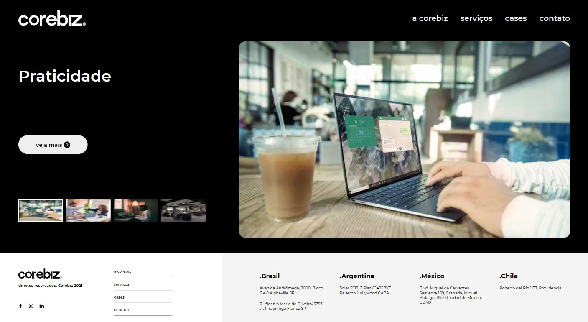
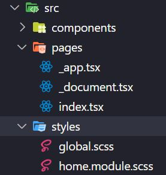
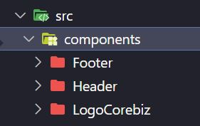
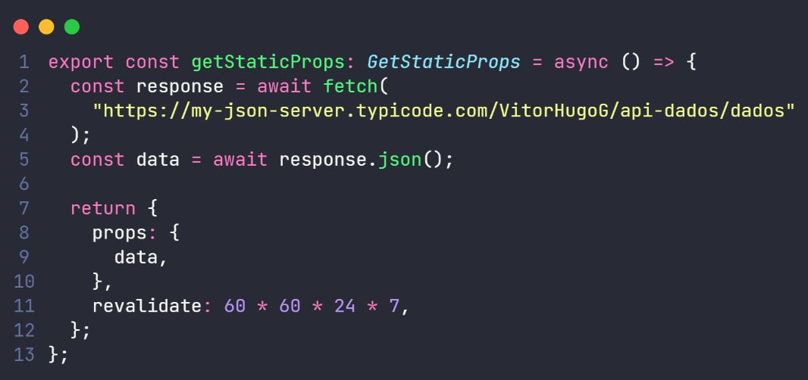

# Go Beyond 2021 - Final Challenge - Corebiz

<h1 align="center">
    
</h1>

## 🚀 O desafio

Fazer o site conforme o design do Adobe XD

Site: Aqui vai um link

## :crystal_ball: Technologies

Este projeto foi desenvolvido utilizando as seguintes tecnologias:
- [React](https://reactjs.org)
- [TypeScript](https://www.typescriptlang.org/)
- [NextJs](https://nextjs.org/)
- [Sass](https://sass-lang.com/)

## :arrow_forward: Instalação e uso

Clone o repositório

```bash
$ git clone https://github.com/evertonvargas/final-challenge

```

Siga os passos abaixo
```bash
# Instale as dependências
$ npm i or yarn

# Inicie o servidor
$ npm run dev or yarn dev
```
Agora você pode acessar [`localhost:3000`](http://localhost:3000) do seu navegador.

## ✨ Docs

O projeto foi desenvolvido utilizando *NextJs* e *Sass* para a parte estilização.

Contém apenas uma página que fica na pasta pages e se chama *index.tsx*, já o seu seu layout fica dentro da pasta styles em *home.module.scss*. Conforme a imagem:



Foram criados apenas 3 componentes para todo o projeto:
- Header
- Footer
- Logo da Corebiz (mesmo svg, apenas com a cor do fill diferente)



### Requisição API

>A parte da requisição da API foi feita com getStaticProps do NextJs, o motivo é pra ter mais performance no site pois vai ser criado uma espécie de Cache estático da página. 
>
>Dessa forma, não preciso sempre fazer chamadas a API solicitando dados. Além disso, foi colocado um revalidate de 1 vez por semana,essa propriedade é utilizada para informar à nossa função quando o conteúdo da página deve ser atualizado.

